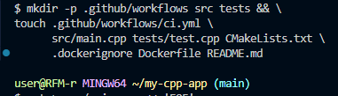
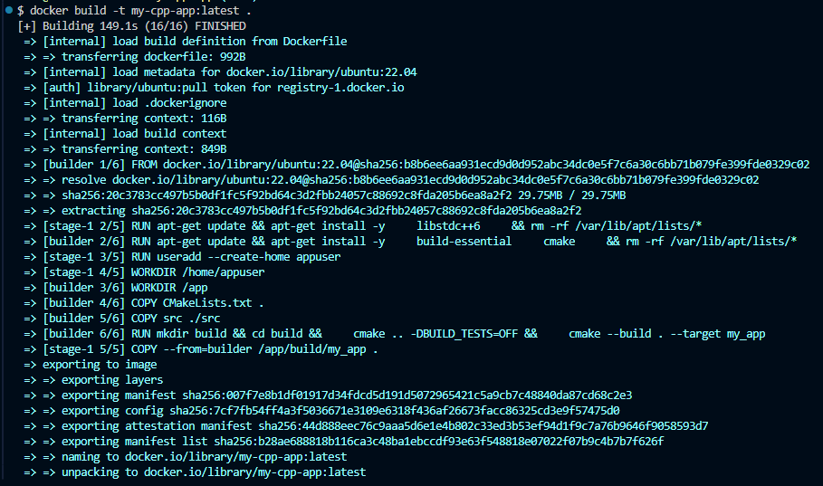
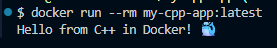
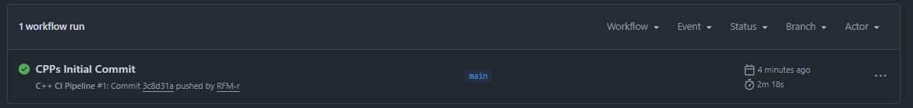

# Самостоятельная работа по DevOps/Pipelines: C++
## 1. Создание директории в новом репозитории:

## 2. Проверка сборки Docker-образа локально/Сборка и запуск:
# 

## 3. Создание и запуск контейнера:
# 

## 4. Commit:
# 

### External Repository: https://github.com/RFM-r/my-cpp-app