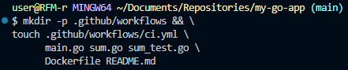
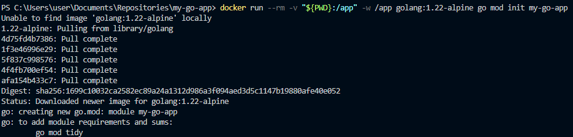
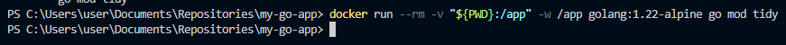
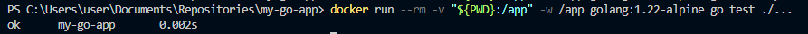
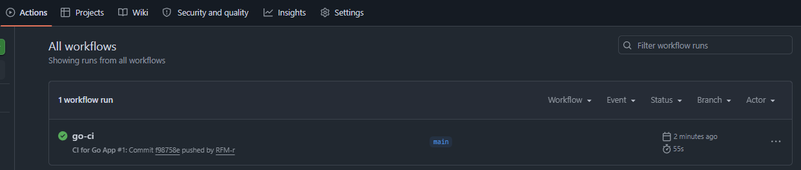
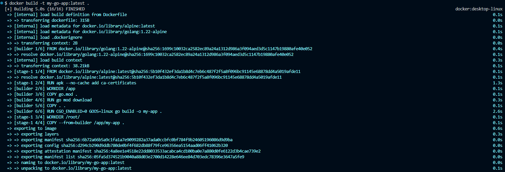
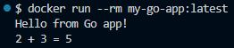

## 1. Создание директории в новом репозитории:
# 
## 2. Инициализация Go-модуля:
# 
# 
## 3. Запуск локального теста:
# 
## 4. Проверка правильного commit-a/push-а во вкладке Actions на GitHub:
# 
## 5. Проверка сборки Docker-образа локально/Сборка и запуск:
# 
## 6. Создание и запуск контейнера:
# 