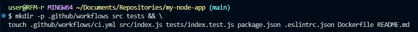
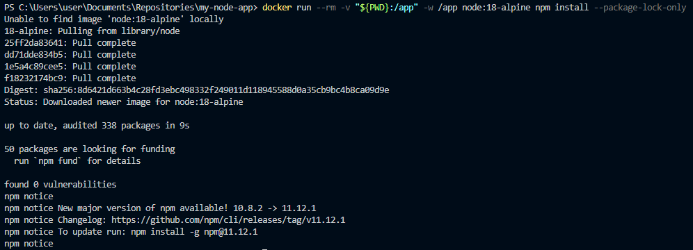
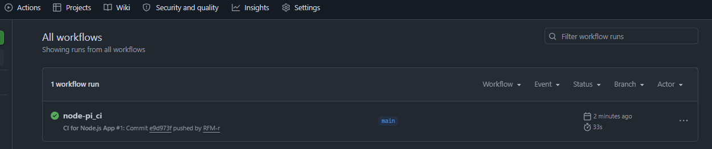
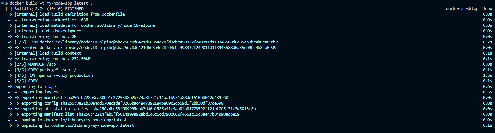
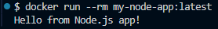

## 1. Создание директории в новом репозитории:
# 
## 2. Сгенерирование файла package-lock.json через Docker:
# 
## 3. Проверка правильного commit-a/push-а во вкладке Actions на GitHub:
# 
## 4. Проверка сборки Docker-образа локально/Сборка и запуск:
# 
## 5. Создание и запуск контейнера:
# 