# Самостоятельная работа по DevOps/Pipelines: Ci/CD Python CLI/PyInstaller + GH Release

## 1. Создание структуры в корневой домашней папке:
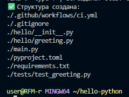

## 2. Тесты в Docker:
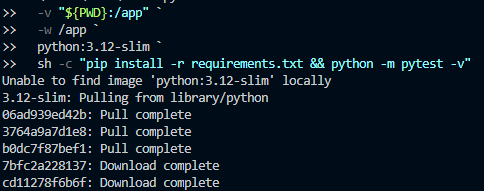
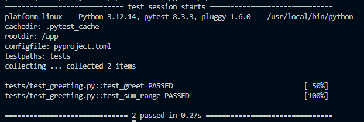

## 3. Сборка:
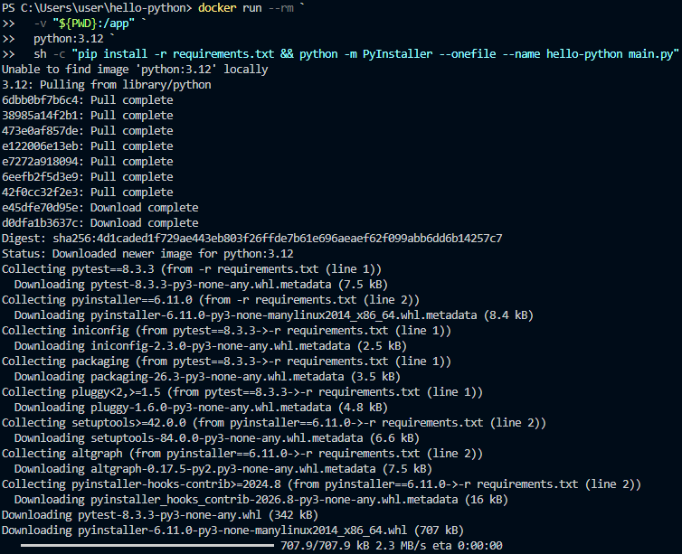

## 4. Commit in Github Actions:
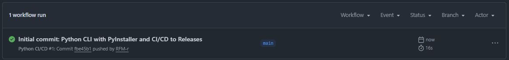

### 4.5 Ссылка на новый репозиторий:
### -- https://github.com/RFM-r/hello-python

## 5. Создание релиза:
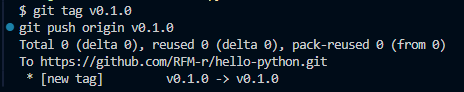
## 5.5. Релиз:
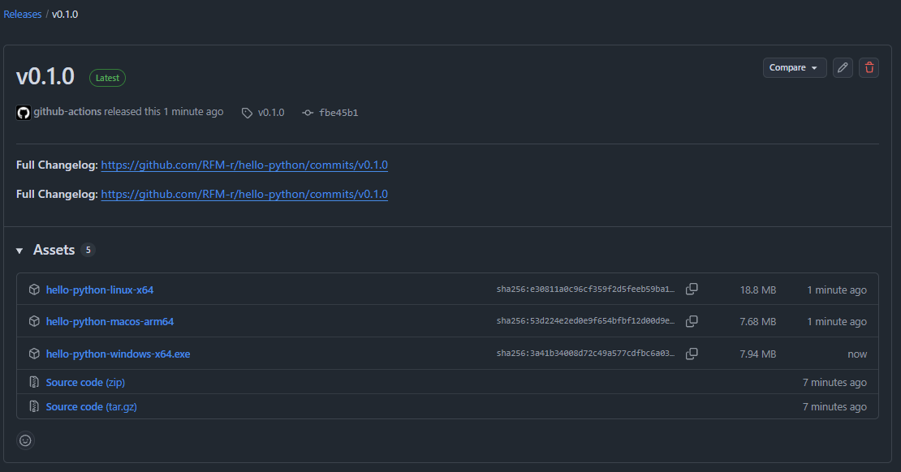

## 6. Скачивание и запуск:
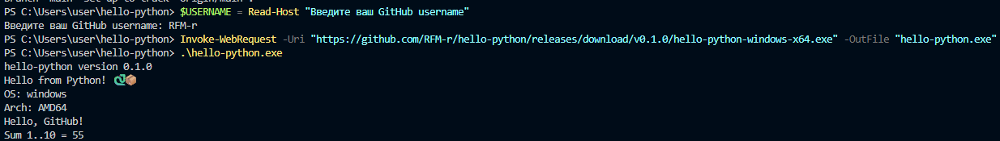

## 7. Проверка форматирования:
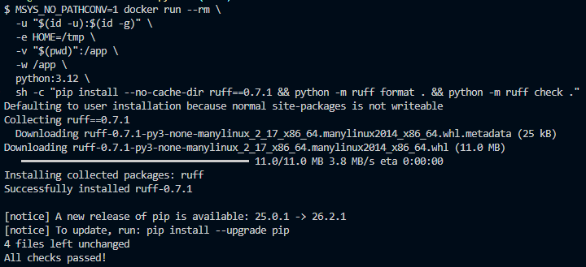

## 7.1. Тесты:
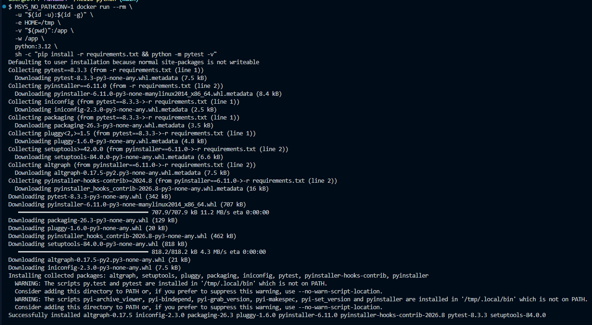
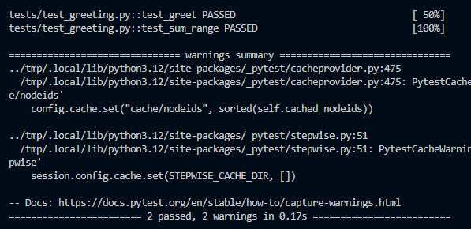

## 7.2. Новый Push и Commit:
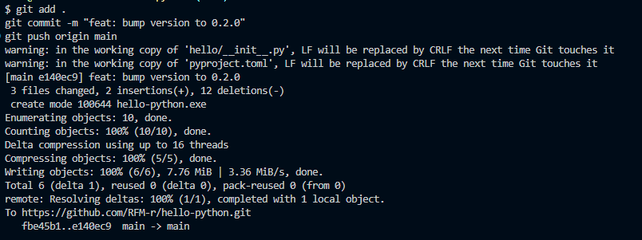

## 7.3. Создание нового тега/новый релиз:
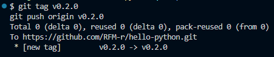
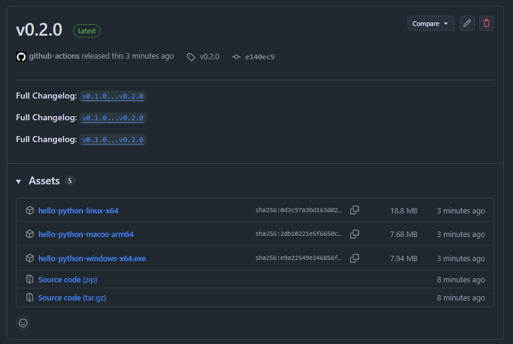

## 7.4. Скачивание и запуск нового релиза:
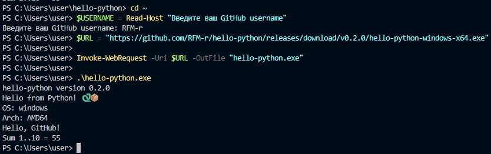