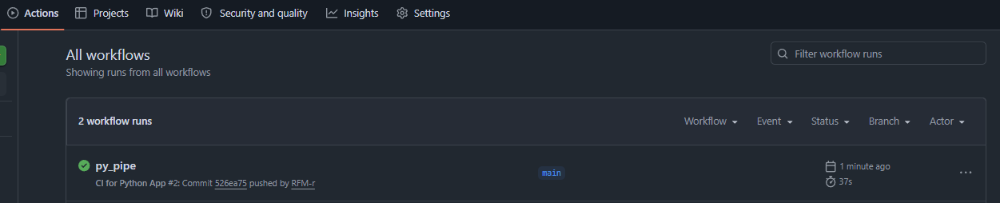
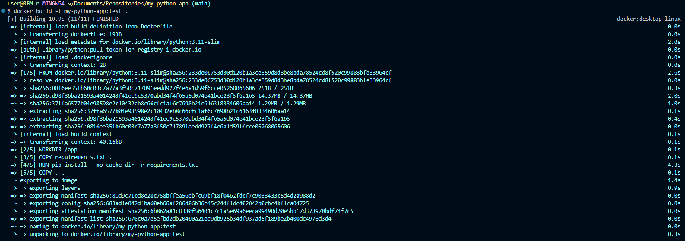
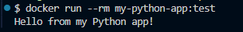

## 1. Создание директории в новом репозитории:
# 
## 2. Проверка правильного commit-a/push-а во вкладке Actions на GitHub:
# 
## 3. Проверка сборки Docker-образа локально/Сборка и запуск:
# 
## 4. Создание и запуск контейнера:
# 