# Самостоятельная работа по DevOps/Pipelines: CI/CD на C#/.NET CLI + GH Release

## 1. Создание структуры в корневой домашней папке:
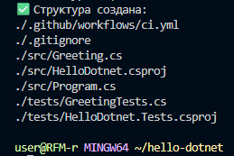

## 2. Тесты в Docker:
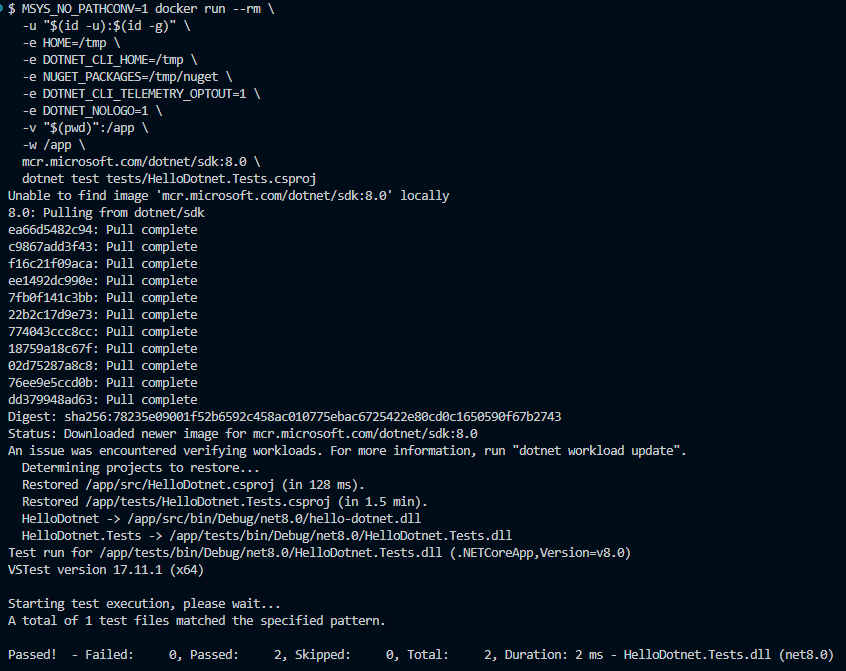

## 3. Сборка:
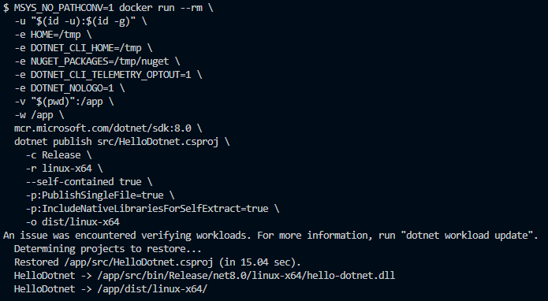

## 4. Push проекта:
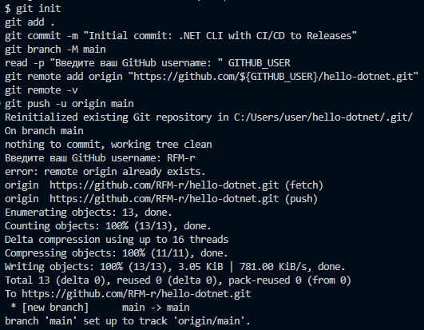

### Ссылка на новый репозиторий: https://github.com/RFM-r/hello-dotnet

## 5. Commit in Github Actions:
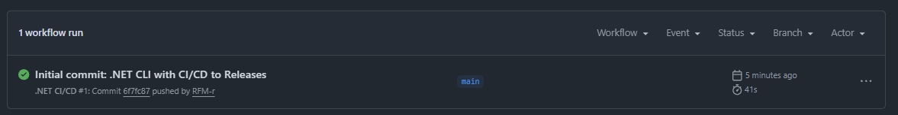

## 6. Создание релиза:
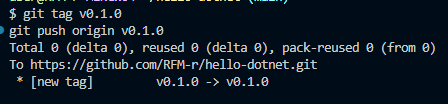
## 6.5. Релиз:
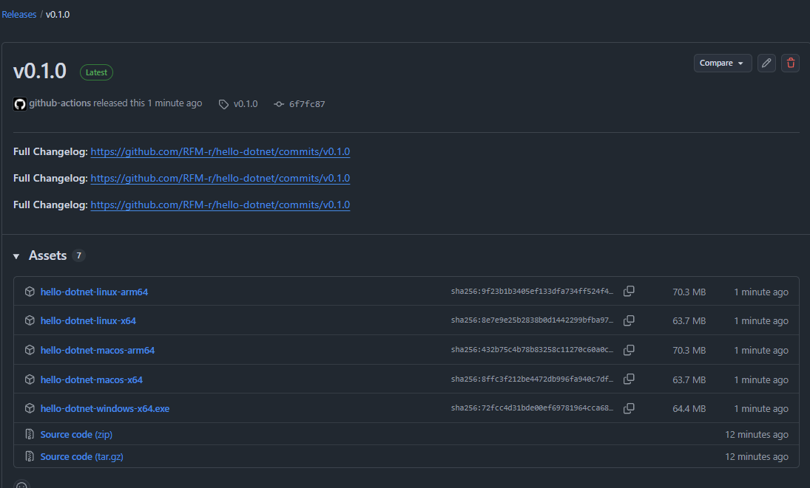

## 7. Скачивание и запуск:
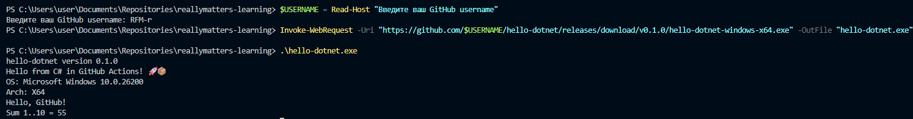

## 8.1. Проверка после обновления версии:
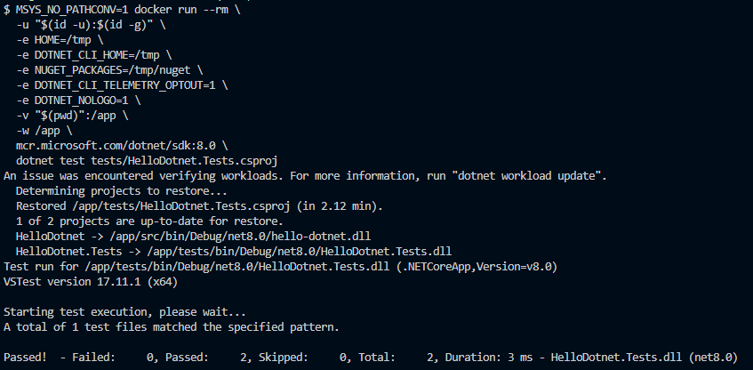

## 8.2. Новый Push и Commit:
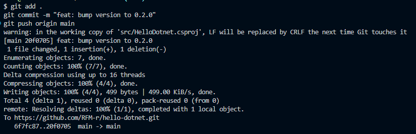

## 8.3. Создание нового тега/новый релиз:
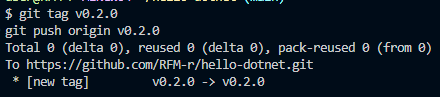
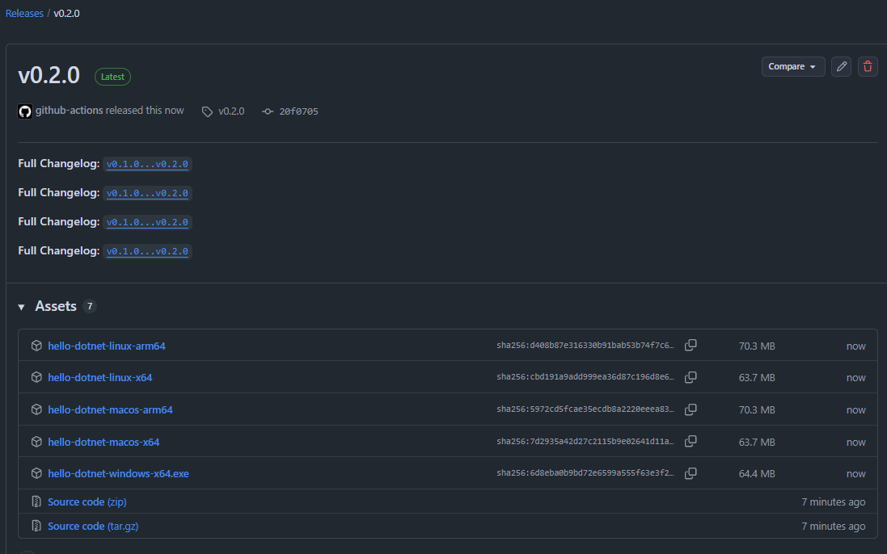

## 8.4. Скачивание и запуск нового релиза:
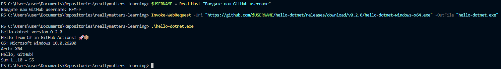