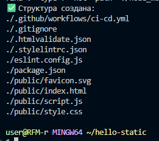
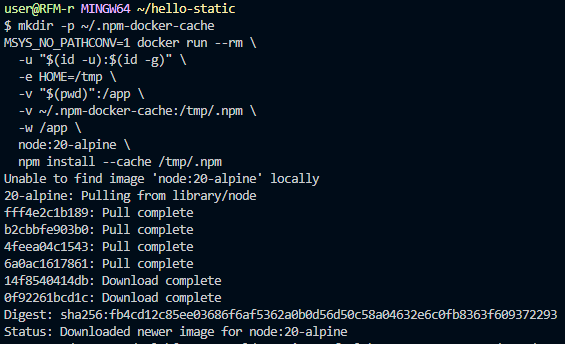
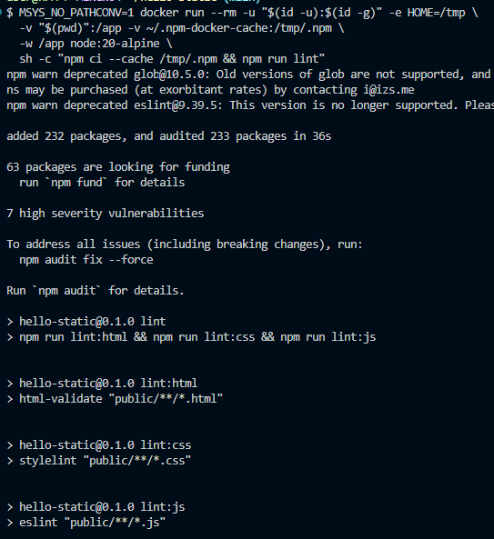
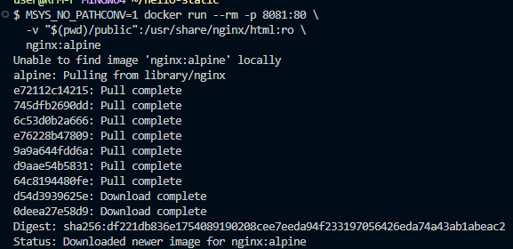
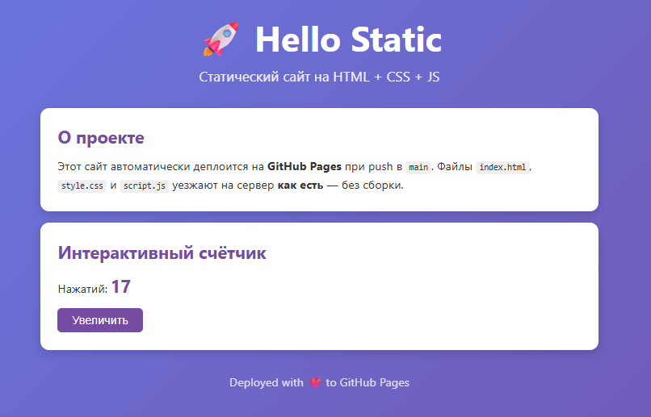
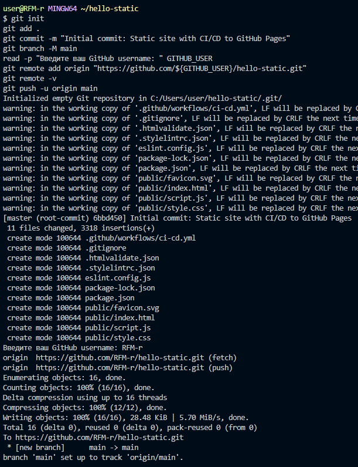
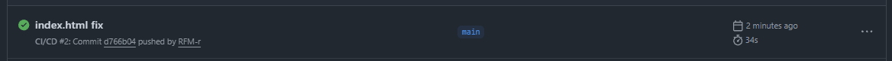
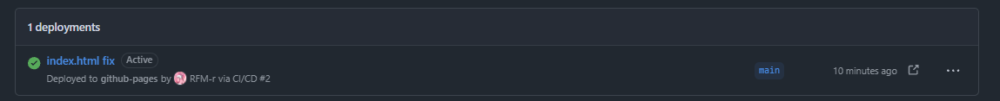
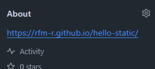
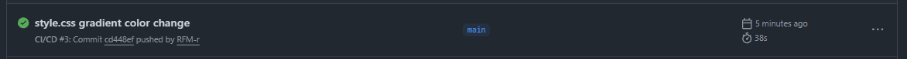

# Самостоятельная работа по DevOps/Pipelines: CI/CD статического сайта (HTML + CSS + JS) на GitHub Pages

## 1. Создание структуры в корневой домашней папке:

## 2. Генерация package-lock.json:

## 3. Локальная валидация:

## 4. Локальный просмотр сайта:

## 5. Commit и Push проекта в новый репозиторий:

### Ссылка на новый репозиторий: https://github.com/RFM-r/hello-static

## 6. Commit in Github Actions:

## 7. Deployments checking:

## 7.1. URL:

## 8. Обновление сайта(Смена одного из цвета градиента в фоне):

## 8.1. Новый commit в GH Actions:

