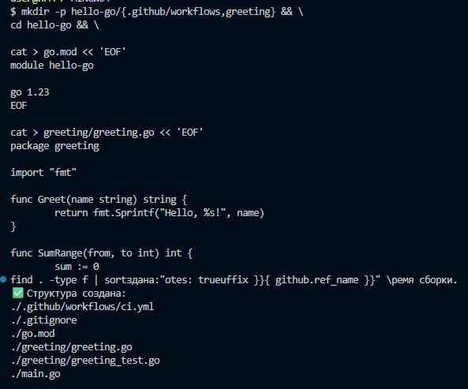
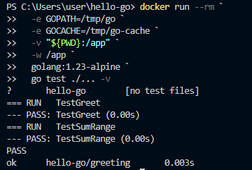
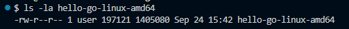
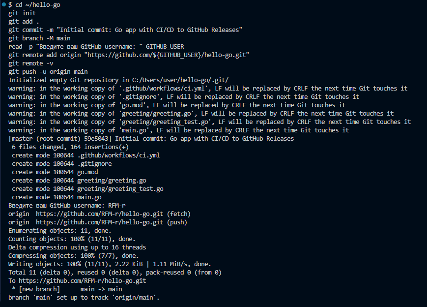
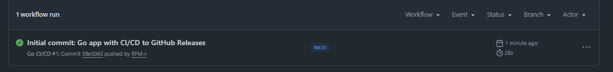
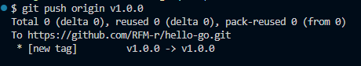
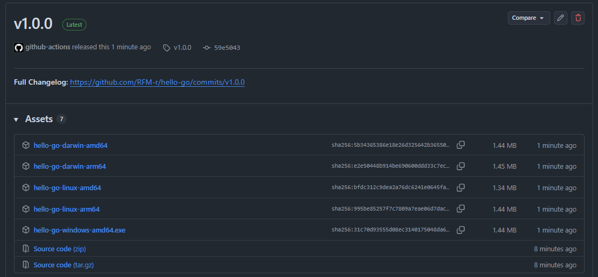
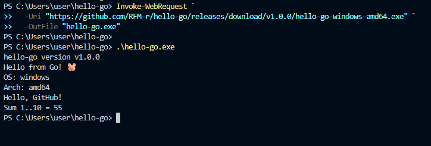

# Самостоятельная работа по DevOps/Pipelines: Ci/CD на Go + GH Release

## 1. Создание структуры в корневой домашней папке:

## 2. Сборка:

## 3. Локальная проверка кросс-компиляции(опциональное создание):

## 4. Push проекта:

### 4.5 Ссылка на новый репозиторий:
### -- https://github.com/RFM-r/hello-go

## 5. Commit in Github Actions:

## 6. Создание релиза(GitHub Releases):

## 7. Скачивание и запуск:
