# Самостоятельная работа по DevOps/Pipelines: CI/CD на Go GUI + GH Release

## 1. Создание структуры в корневой домашней папке:
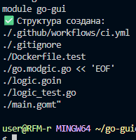

## 2. Сборка тестового образа с GUI-зависимостями:
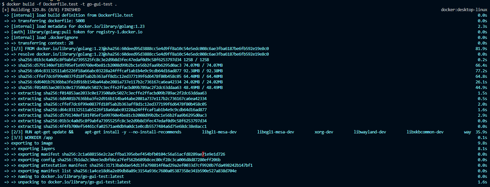

## 2.5. Генерация go.sum:
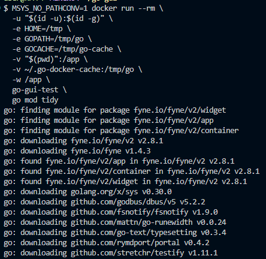
## 2.5.1. Проверка генерации:
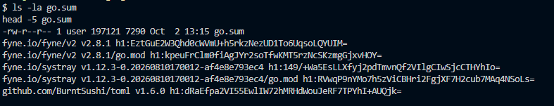

## 3. Тесты в Docker:
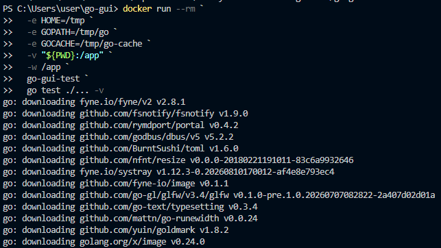
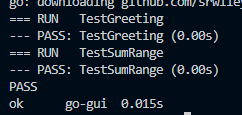

## 4. Локальная сборка GUI-бинарника под Linux в Docker
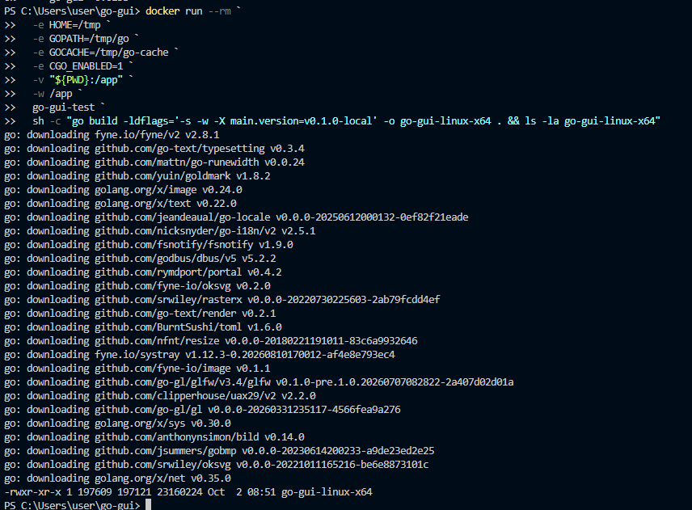

## 5. Push проекта:
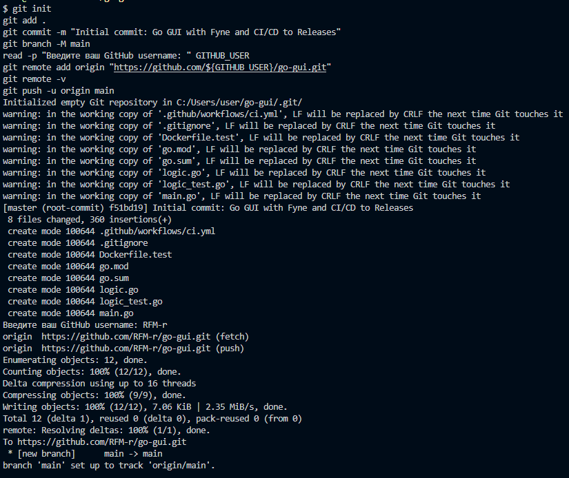
### 5.5 Ссылка на новый репозиторий: https://github.com/RFM-r/go-gui

## 6. Создание релиза(GitHub Releases):
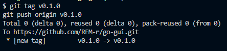
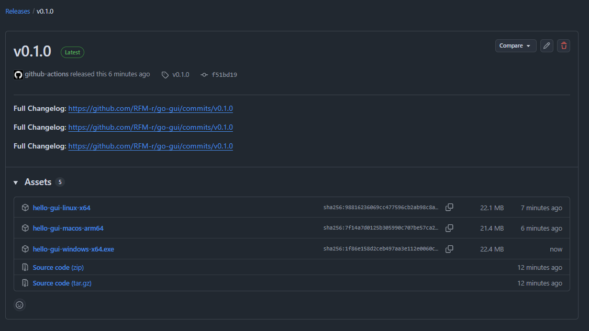

## 7. Скачивание и запуск:
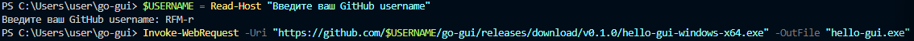
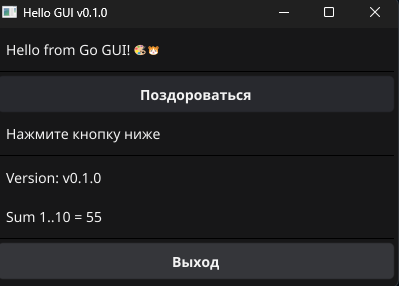

## 8. Тест #2:
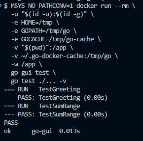

## 8.1. Новый commit и push:
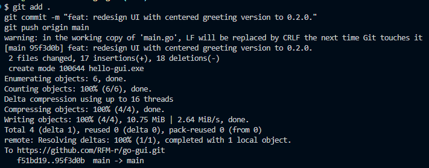

## 8.2. Создание нового тега/новый релиз:
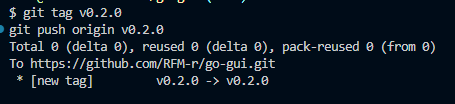
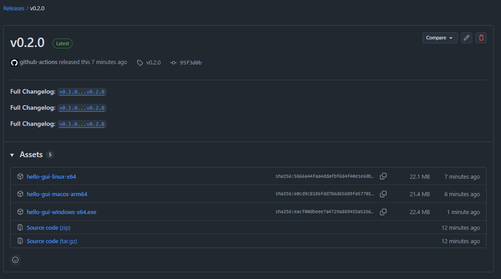

## 8.3. Проверка новой версии:
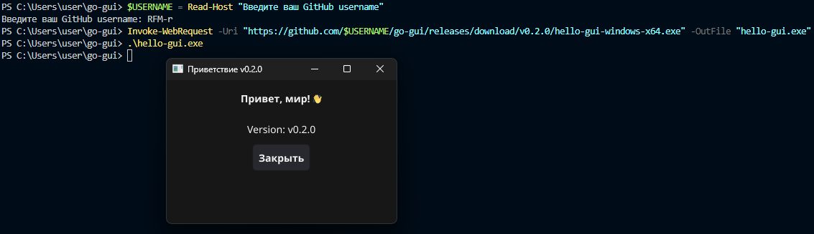