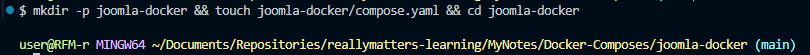
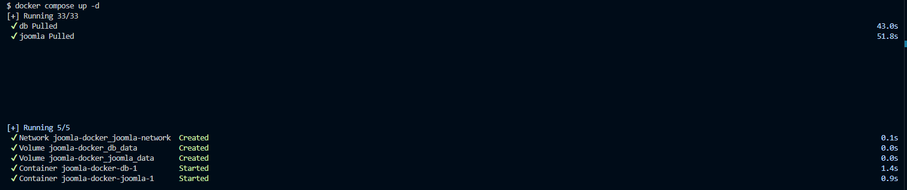
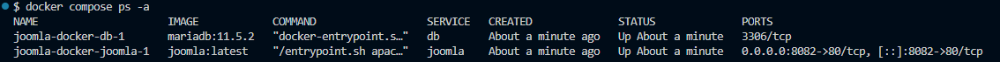
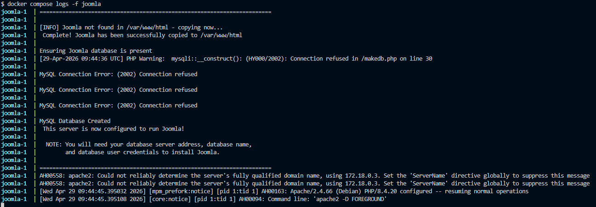
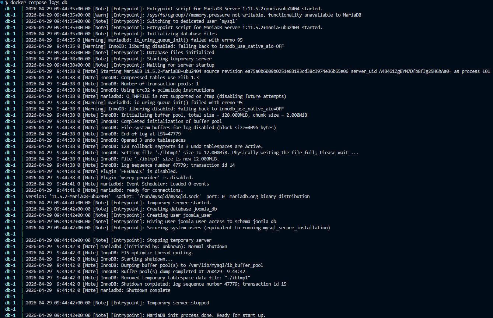
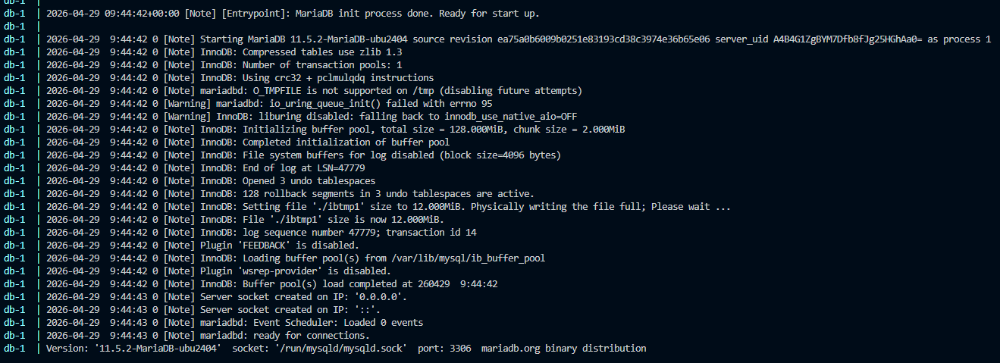
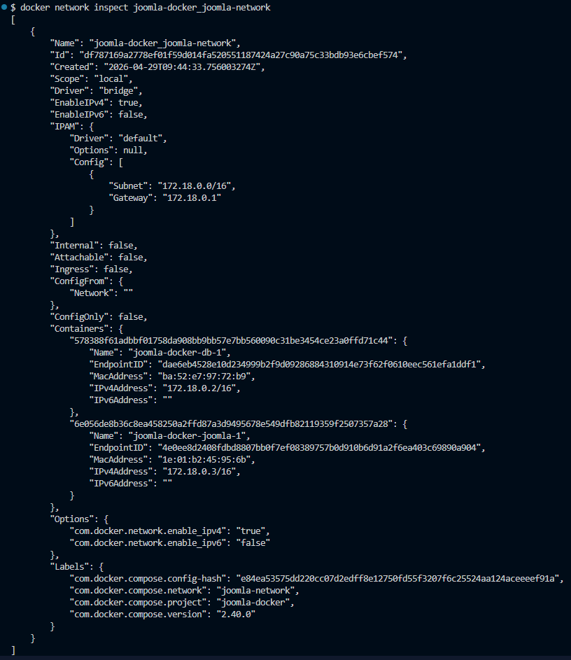
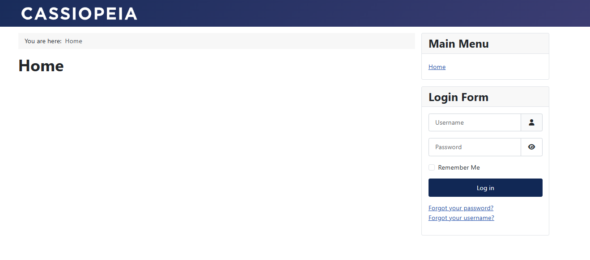
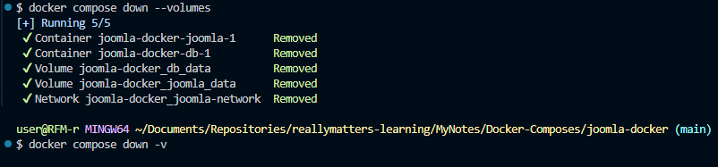

# Самостоятельная работа по Информационным технологиям, Docker Compose: Joomla
## 1. Создание каталога проекта:
# 
# 

## 2. Запуск всех сервисов:
# 

## 3. Проверка статуса:
# 

## 4. Просмотр логов Joomla:
# 

## 5. Проверка логов MySQL:
# 
# 

## 6. Проверка сети:
# 

## 7. Веб-сайт:
# 

## 8. Остановка и удаление контейнеров и volumes:
# 