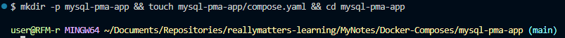
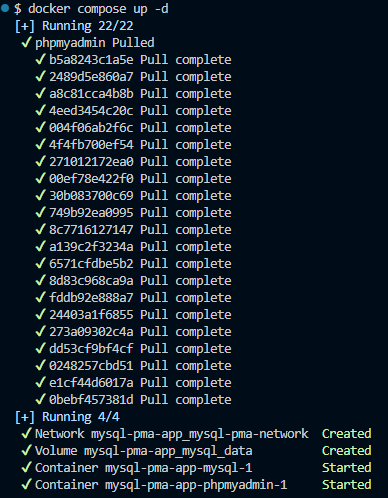
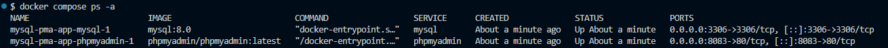
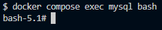

# Самостоятельная работа по Информационным технологиям, Docker Compose: MySQL + phpMyAdmin

## 1. Создание каталога проекта:
# 
# 

## 2. Запуск всех сервисов:
# 

## 3. Проверка статуса:
# 

## 4. Проверка конфигурации текущего проекта:
# 

## 5. Вход в контейнер MySQL:
# 