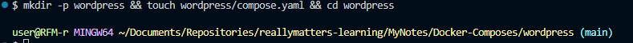
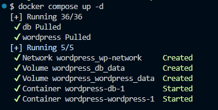
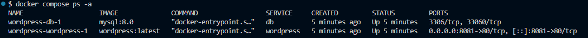
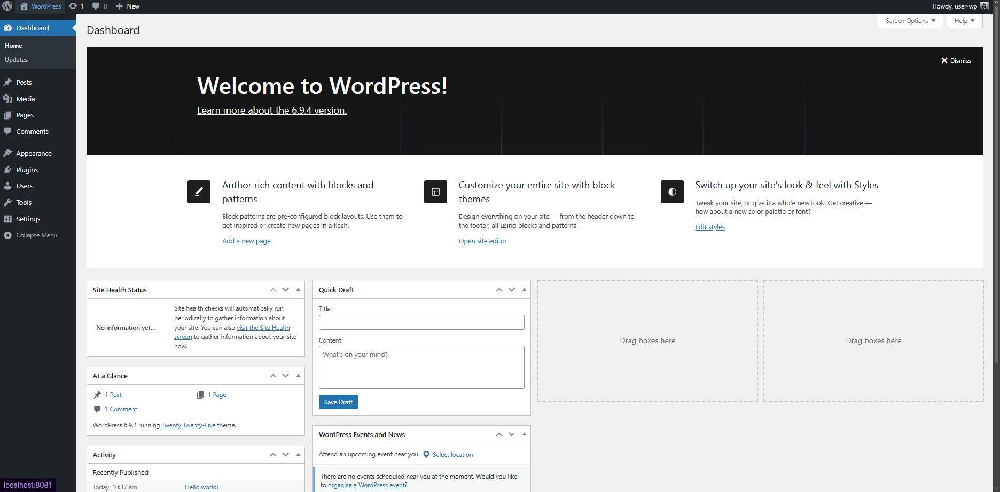
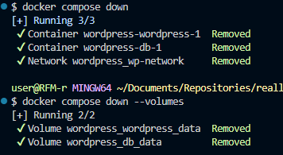

# Самостоятельная работа по Информационным технологиям, Docker Compose: WordPress
## 1. Создание каталога проекта:
# 
# 

## 2. Запуск всех сервисов:
# 

## 3. Проверка статуса:
# 

## 4. Веб-сайт:
# 

## 5. Остановка и удаление контейнеров и volumes:
# 