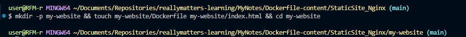
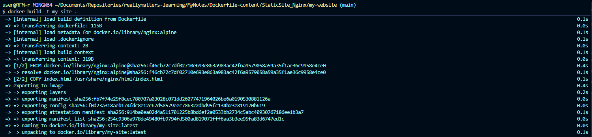
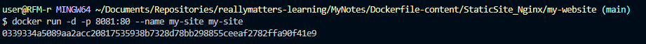

# Самостоятельная работа по Информационным технологиям, Dockerfile: Static Site: Nginx

## 1. Создание файла my-website и вставка Dockerfile с index.html в него:
# 

## 2. Выполнение команды:
# 

## 3. Запуск образа:
# 

## 4. Информация находящаяся на сайте по адресу http://localhost:8081 :
# 