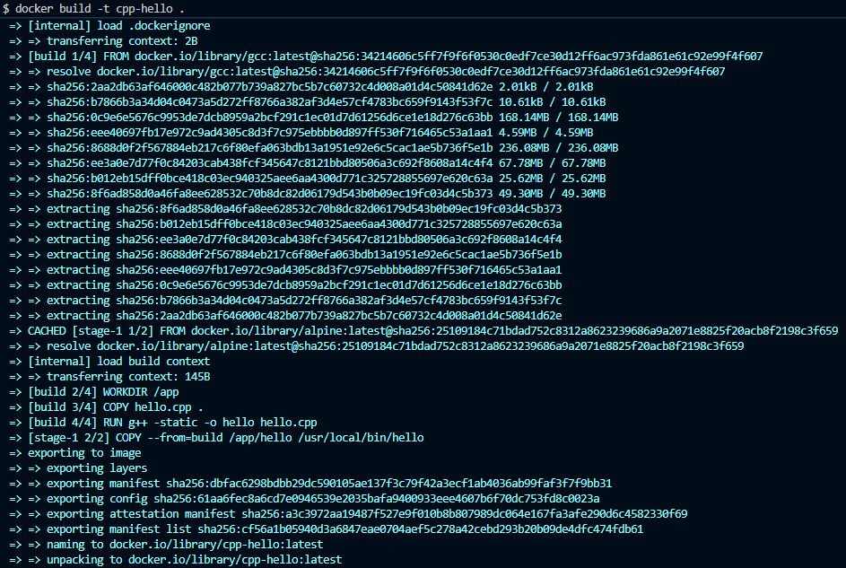
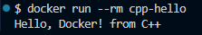
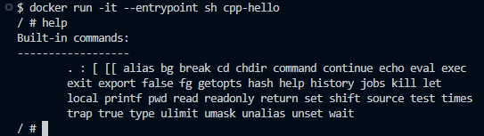

# Самостоятельная работа по Информационным технологиям, Dockerfile: C++

## 1. Создание структуры проекта:

## 2. Сборка образа:

## 3. Запуск контейнера:

## 4. Вход в контейнер и ввод команды help:
