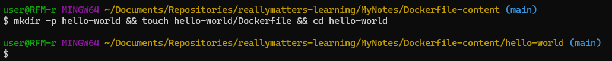
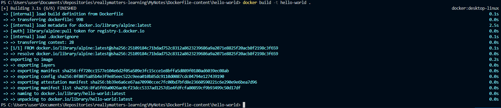
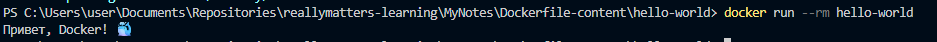

# Самостоятельная работа по Информационным технологиям, Dockerfile: Hello World

## 1. Создание структуры проекта с помощью Git bash:
# 

## 2. Выполнение команды:
# 

## 3. Запуск команды "hello-world":
# 