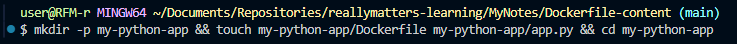
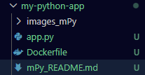
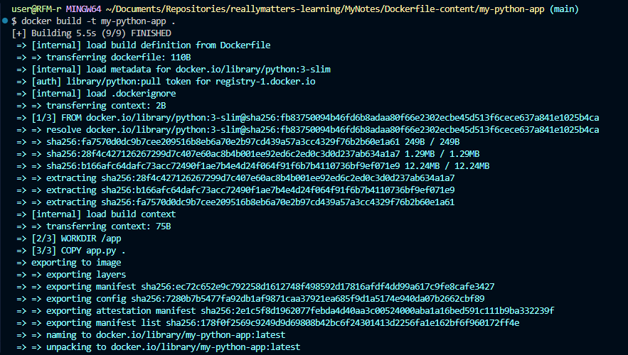
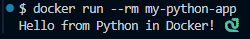

# Самостоятельная работа по Информационным технологиям, Dockerfile: Simple App on Python

## 1. Создание структуры проекта:
# 
# 

## 2. Сборка и запуск:
# 

## 3. Создание и запуск контейнера:
# 
