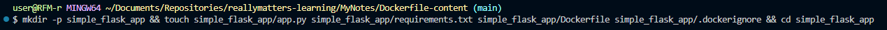
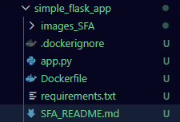
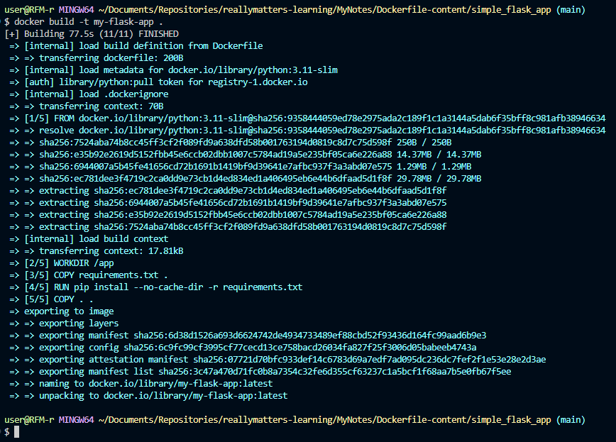
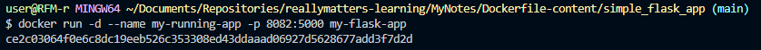
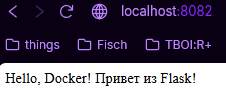

# Самостоятельная работа по Информационным технологиям, Dockerfile: Flask + Python

## 1. Создание директории и структуры проекта:
# 
# 

## 2. Сборка образа:
# 

## 3. Запуск контейнера:
# 

## 4. Проверка работы сайта:
# 