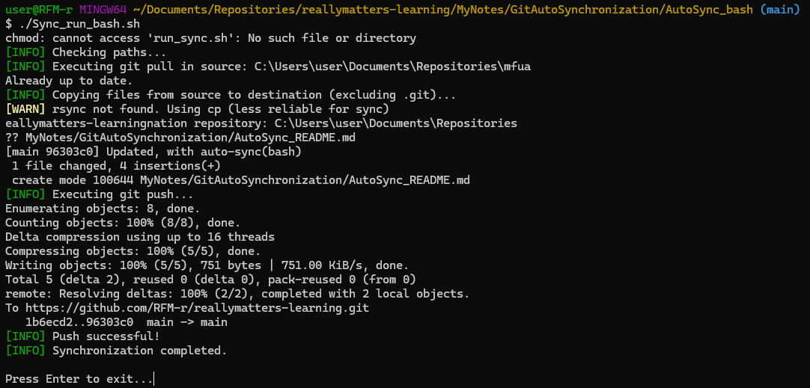
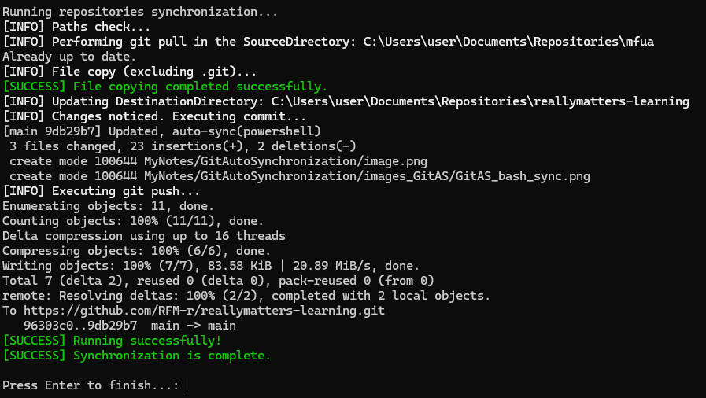

# Самостоятельная работа по скрипту синхронизации репозиториев.
## Две папки:
## 1. Папка "AutoSync_bash" - В нём находятся:
```shell
Sync_Repos.sh
Sync_run_bash.sh
```
#### - Sync_run_bash.sh" - Недакий "лаунчер", запускающий скрипт синхронизации.
#### - "Sync_Repos.sh" - Cам скрипт.
### Синхронизирует репозитории при помощи bash. Требуется использовать Git bash, чтобы запустить файлы.

## 2. Папка "AutoSync_PowerShell"  - В нём находятся:
```shell
Sync_Repositories.ps1
Sync_run.bat
```
#### - "Sync_run.bat" - Тоже "лаунчер", запускающий скрипт синхронизации.
#### - "Sync_Repositories.ps1" - Скрипт, работающий на PowerShell.
### Синхронизирует при помощи PowerShell. Запускать нужно Sync_run.bat.

### Результат выполнения скрипта "Sync_run_bash.sh". Bash:


### Результат выполнения скрипта "Sync_run.bat". PowerShell:
